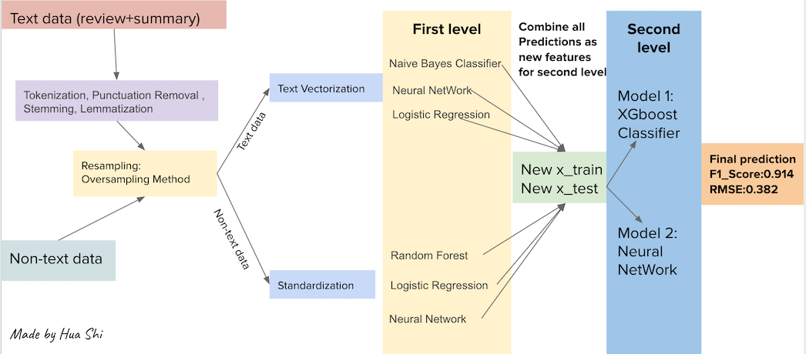

# NLP_Analysis_Amazon_Reviews
## Goal: 
Using Amazon data to predict if the review is negative or positive
- If rating <=3  negative review  0
- If rating >=4  positive review  1
## Attribute information
1.  helpful - helpfulness rating of the review [2,3], e.g. 2/3 ,  2 is numerator , 3 id denominator
            Numerator: Number of readers who found the review is  helpful
            Denominator: Number of readers who indicated whether they found the review helpful or not.
2. review Text - text of the review
3. overall - rating of the product
4. summary - summary of the review
5. unix Review Time - time of the review (unix time)

## Data cleaning and preprocessing
1. Combined summary column and review column as “combined_text”
2. Created a target column based on rating column 
3. Created two columns, one is helpfulness_numerator ,another one is helpfulness_denominator 
4. Tokenization, Punctuation removal , stemming, lemmatization 
5. After step 4.  created a column - review_len which is length of review(text)
6. Data Resampling (Oversampling Method)
## Modeling

## Presentation:https://docs.google.com/presentation/d/1pjb43sTBqI7z4jKIwuu9FlcUvjYyJvtK07uPGz71drQ/edit?usp=sharing
